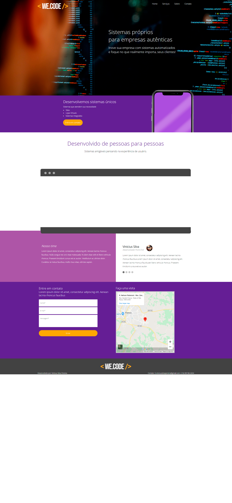

# <WE.CODE> Sistemas

## Sobre o Projeto
O projeto teve como objetivo implementar uma landing page responsiva para uma empresa ficticia de desenvolvimento de sistemas web/mobile. Foram utilizadas boas praticas do CSS3 responsivo, implementação de um botão que chama um Menu Modal para que o cliente entre em contato com a empresa, bullet sliders com os membros da equipe, e um mapa com geolocalização do local da empresa. 

## Desktop Viewport

## Mobile Viewport

## Implementação do "Bullet Slider"
Foi implementado via Javascript/Jquery um "Bullet Slider" para apresentar os membros do time de desenvolvimento, o Slider é automatico e é alterado a cada 3 segundos. 

## Mobile Menu
Foi implementado via Javascript/Jquery o Mobile Menu, que efetua uma ação quando o usuário clica no icone de menu, que aparece quando a página entra no modo responsivo para o viewport size mobile. 

